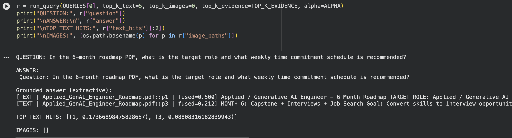
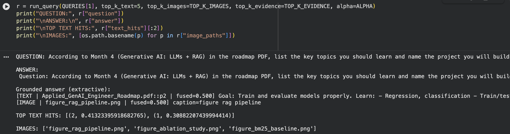

# Big-Data-analytics-week-1
week 1 Lab
week 2 Lab

Week 3 Lab (Results)

>>Dataset Description
The dataset consists of two PDF documents related to Artificial Intelligence and Generative AI learning resources and roadmaps. The documents include textual explanations (AI trends, learning paths, tools) and visual content such as diagrams, timelines, and roadmap images. Text is extracted from PDFs, while images are stored with short captions and used as evidence in the multimodal RAG setting. Relevance is defined by whether the retrieved text or image directly supports answering a user query about AI concepts or learning paths

>>Results Table
The table below reports the ablation study results across different configurations. We compare chunking strategies (page-based vs fixed-size), retrieval methods (sparse, dense, hybrid, hybrid + rerank), and RAG modes (text-only vs multimodal) using Precision@5, Recall@10, and Faithfulness.
Query × Method × Precision@5 × Recall@10 × Faithfulness

| Query   | Method                                 |   Precision@5 |   Recall@10 |   Faithfulness |
|:--------|:---------------------------------------|--------------:|------------:|---------------:|
| Q1      | top_k_text=2 | alpha=0.2 | text_only   |             0 |           0 |          0.828 |
| Q1      | top_k_text=2 | alpha=0.5 | text_only   |             0 |           0 |          0.828 |
| Q1      | top_k_text=2 | alpha=0.8 | text_only   |             0 |           0 |          0.828 |
| Q1      | top_k_text=5 | alpha=0.2 | text_only   |             0 |           0 |          0.839 |
| Q1      | top_k_text=5 | alpha=0.5 | text_only   |             0 |           0 |          0.839 |
| Q1      | top_k_text=5 | alpha=0.8 | text_only   |             0 |           0 |          0.839 |
| Q1      | top_k_text=10 | alpha=0.2 | text_only  |             0 |           0 |          0.851 |
| Q1      | top_k_text=10 | alpha=0.5 | text_only  |             0 |           0 |          0.851 |
| Q1      | top_k_text=10 | alpha=0.8 | text_only  |             0 |           0 |          0.851 |
| Q1      | top_k_text=2 | alpha=0.2 | multimodal  |             0 |           0 |          0.483 |
| Q1      | top_k_text=2 | alpha=0.5 | multimodal  |             0 |           0 |          0.75  |
| Q1      | top_k_text=2 | alpha=0.8 | multimodal  |             0 |           0 |          0.754 |
| Q1      | top_k_text=5 | alpha=0.2 | multimodal  |             0 |           0 |          0.517 |
| Q1      | top_k_text=5 | alpha=0.5 | multimodal  |             0 |           0 |          0.767 |
| Q1      | top_k_text=5 | alpha=0.8 | multimodal  |             0 |           0 |          0.839 |
| Q1      | top_k_text=10 | alpha=0.2 | multimodal |             0 |           0 |          0.517 |
| Q1      | top_k_text=10 | alpha=0.5 | multimodal |             0 |           0 |          0.767 |
| Q1      | top_k_text=10 | alpha=0.8 | multimodal |             0 |           0 |          0.839 |
| Q2      | top_k_text=2 | alpha=0.2 | text_only   |             0 |           0 |          0.753 |
| Q2      | top_k_text=2 | alpha=0.5 | text_only   |             0 |           0 |          0.753 |
| Q2      | top_k_text=2 | alpha=0.8 | text_only   |             0 |           0 |          0.753 |
| Q2      | top_k_text=5 | alpha=0.2 | text_only   |             0 |           0 |          0.773 |
| Q2      | top_k_text=5 | alpha=0.5 | text_only   |             0 |           0 |          0.773 |
| Q2      | top_k_text=5 | alpha=0.8 | text_only   |             0 |           0 |          0.773 |
| Q2      | top_k_text=10 | alpha=0.2 | text_only  |             0 |           0 |          0.784 |
| Q2      | top_k_text=10 | alpha=0.5 | text_only  |             0 |           0 |          0.784 |
| Q2      | top_k_text=10 | alpha=0.8 | text_only  |             0 |           0 |          0.784 |
| Q2      | top_k_text=2 | alpha=0.2 | multimodal  |             0 |           0 |          0.652 |
| Q2      | top_k_text=2 | alpha=0.5 | multimodal  |             0 |           0 |          0.647 |
| Q2      | top_k_text=2 | alpha=0.8 | multimodal  |             0 |           0 |          0.652 |
| Q2      | top_k_text=5 | alpha=0.2 | multimodal  |             0 |           0 |          0.681 |
| Q2      | top_k_text=5 | alpha=0.5 | multimodal  |             0 |           0 |          0.676 |
| Q2      | top_k_text=5 | alpha=0.8 | multimodal  |             0 |           0 |          0.773 |
| Q2      | top_k_text=10 | alpha=0.2 | multimodal |             0 |           0 |          0.696 |
| Q2      | top_k_text=10 | alpha=0.5 | multimodal |             0 |           0 |          0.691 |
| Q2      | top_k_text=10 | alpha=0.8 | multimodal |             0 |           0 |          0.784 |
| Q3      | top_k_text=2 | alpha=0.2 | text_only   |             0 |           0 |          0.861 |
| Q3      | top_k_text=2 | alpha=0.5 | text_only   |             0 |           0 |          0.861 |
| Q3      | top_k_text=2 | alpha=0.8 | text_only   |             0 |           0 |          0.861 |
| Q3      | top_k_text=5 | alpha=0.2 | text_only   |             0 |           0 |          0.861 |
| Q3      | top_k_text=5 | alpha=0.5 | text_only   |             0 |           0 |          0.861 |
| Q3      | top_k_text=5 | alpha=0.8 | text_only   |             0 |           0 |          0.861 |
| Q3      | top_k_text=10 | alpha=0.2 | text_only  |             0 |           0 |          0.873 |
| Q3      | top_k_text=10 | alpha=0.5 | text_only  |             0 |           0 |          0.873 |
| Q3      | top_k_text=10 | alpha=0.8 | text_only  |             0 |           0 |          0.873 |
| Q3      | top_k_text=2 | alpha=0.2 | multimodal  |             0 |           0 |          0.645 |
| Q3      | top_k_text=2 | alpha=0.5 | multimodal  |             0 |           0 |          0.81  |
| Q3      | top_k_text=2 | alpha=0.8 | multimodal  |             0 |           0 |          0.814 |
| Q3      | top_k_text=5 | alpha=0.2 | multimodal  |             0 |           0 |          0.645 |
| Q3      | top_k_text=5 | alpha=0.5 | multimodal  |             0 |           0 |          0.81  |
| Q3      | top_k_text=5 | alpha=0.8 | multimodal  |             0 |           0 |          0.861 |
| Q3      | top_k_text=10 | alpha=0.2 | multimodal |             0 |           0 |          0.645 |
| Q3      | top_k_text=10 | alpha=0.5 | multimodal |             0 |           0 |          0.81  |
| Q3      | top_k_text=10 | alpha=0.8 | multimodal |             0 |           0 |          0.861 |

Screenshot
### Text-only RAG

### Multimodal RAG

>>Failure Case:
In some cases, the system retrieved text chunks that matched the query keywords but did not fully explain the concept. This caused the generated answer to include information that was only partially supported by the retrieved evidence, reducing faithfulness.
>>System Improvement:
A clear improvement would be to use stronger dense embeddings with a cross-encoder reranker so that evidence is selected based on semantic meaning rather than keyword overlap. This would improve retrieval quality and make the generated answers more accurate and better grounded.

